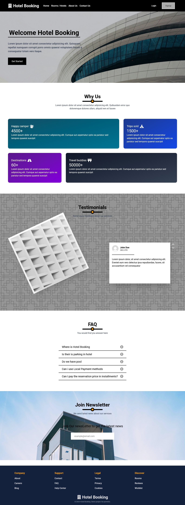

# 🏨 Hotel Booking (MERN Stack)

# Disclaimer

> This project (**Hotel Booking**) was created **for portfolio and learning purposes only**. It is **not a real booking platform**, and no actual reservations, payments, or services are provided.

# Highlight

This is a demo hotel booking platform built for portfolio and learning purposes, showcasing full-stack (MERN) development skills.

Key Features:

- Authentication: you can login and sign up using email/password, or using google for fast/prefered authentication
- Browsing Rooms: You can browse and search rooms, filter by preferences, and view detailed information about each one, it's reserved/busy days and when you can reserve, seeing other reviews and hotel rules
- Browse Profile Info: you can change your profile image, name, seeing your reviews in activities page and reservation history
- Managing Payments: i used Stripe to make payment which is fully working, _*Don't enter real payment information that will pay really*_
- Manage Bookings: in the reservation form you can't book reserved days, or passed days, and can't make race in payment since if the room is reserved while you enter payment information your reservation will be refunded

# Project Overview

The booking website is a demo project built to showcase booking management features and room browsing functionality.

Here’s a preview of the website interface:

## 🛠️ Tech Stack

- **Frontend**: React.js with Typescript
- **Backend**: Node.js with Express.js
- **Database**: MongoDB
- **Runtime**: Node.js (MERN Stack)
- **Testing**: Jest.js

## Author

This project was developed, authored, and is solely maintained by:

Omar Yasser

GitHub: [here](https://github.com/Omar-Yasser-Frontend)

LinkedIn: [Profile Here](https://www.linkedin.com/in/omar-yasser-2440aa262/)

Website: [Demo](https://booking-hotel-o143.vercel.app)

## Contributing

Contributions are welcome for improving the demo, fixing bugs, or adding accessibility improvements. Before submitting a PR, ensure:

You do not add real sponsor logos or claims of partnership.
You include tests for any new logic where applicable.

To contribute:

- Fork the repo
- Create a feature branch
- Make your changes
- Open a pull request describing the change
